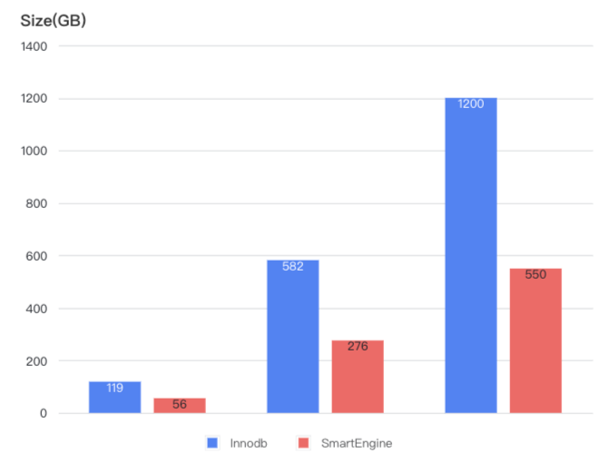
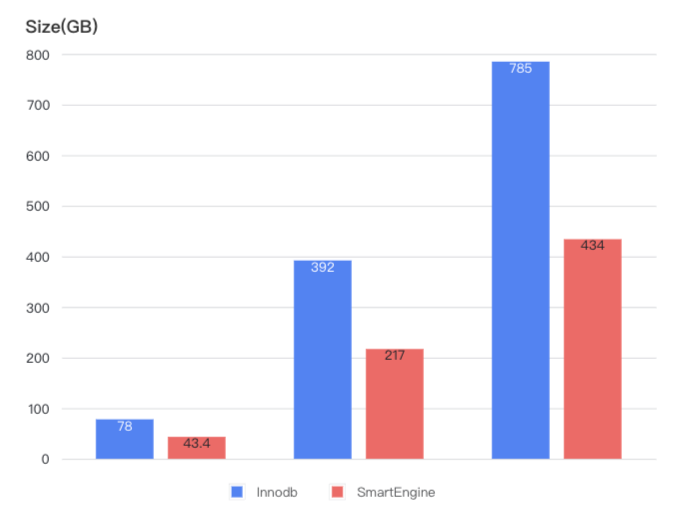
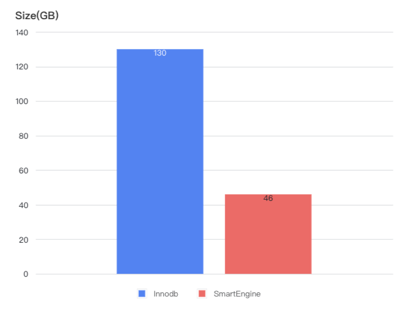
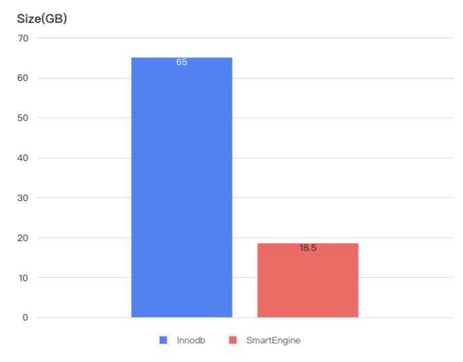

<h1>Cost-Effectiveness Comparison</h1>
<h2>Storage Space Comparison</h2>

- Sysbench inserts 2000000, 10000000, 20000000 rows of data into 256 tables respectively.

- Tpcc 1000 warehouses, 5000 warehouses, 10000 warehouses

- Tpch 100G

- ClickBench

